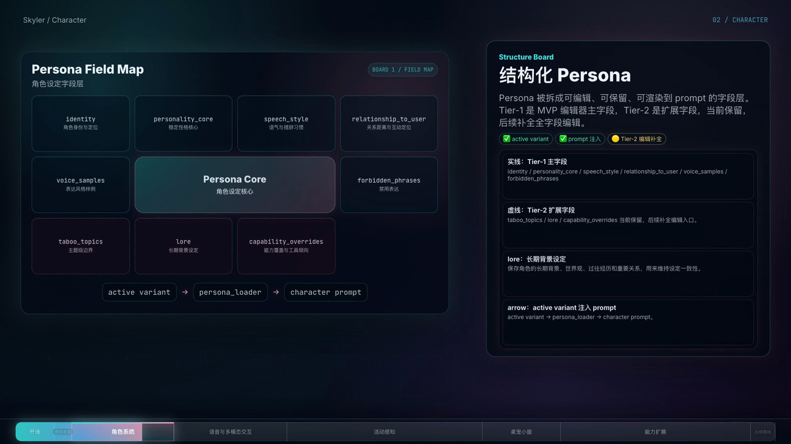

# Skyler

A Live2D desktop AI companion system with structured persona, character state,
activity context, voice interaction, and tool extension.

Skyler is not just a chatbot with a character skin. The project explores how a
desktop character can keep persona structure, runtime state, recent activity
context, voice expression, and external capabilities in one system.

Language: **English** / [简体中文](README_zh-CN.md)

## Demo

[](https://github.com/XguihuaX/Skyler/releases/tag/demo-v0.1)

Final demo video: [Skyler Demo v0.1](https://github.com/XguihuaX/Skyler/releases/tag/demo-v0.1)

Video details:

- 1920×1080
- ~6:29
- Character system section before voice interaction
- Stereo audio

## What is currently built

- **Two desktop forms**: a full main panel and a transparent desktop-pet window.
- **Live2D runtime**: model loading, rendering, framing, idle animation, lipsync,
  and multi-model management.
- **Interaction input**: text, voice, image, and file input for the current turn.
- **Voice path**: Silero VAD, ASR, LLM streaming, TTS, and Live2D expression
  hooks. Emotional TTS is wired; Live2D motion planning is still future work.
- **Character system**: structured Persona fields, active variant loading,
  `card_type`, social / assistant card metadata, and `CharacterState`.
- **State and memory context**: mood, intimacy, current thought, current activity,
  short-term window, conversation summary, long-term semantic memory, user
  profile, and activity context.
- **Activity context**: foreground app, browser title / URL, document path, and
  activity sessions are stored locally and can be summarized into the prompt.
- **Desktop perception**: read-only AX / UI Tree summary for the current
  foreground app, used on demand instead of continuously reading every window.
- **Capability layer**: `CapabilityRegistry`, native capabilities, MCP client /
  server, API provider configuration, per-tool switches, and a confirm-gate
  framework.

## In progress

- DailyAgent beyond Stage 1. Stage 1 already connects daily plan generation, a
  current-activity ticker, and state write-back; a full FSM and multi-character
  scheduling are not finished.
- Runtime separation between social cards and assistant cards.
- Context arbitration: deciding which evidence should win when persona, memory,
  activity, screen context, and tool results disagree.
- Window Roster / Watchlist / target-PID deep read for layered desktop
  perception.
- End-to-end validation for dangerous tools and write-action confirmation.
- Long-term persistence for image / file inputs.
- Packaging, release flow, and auto-update.

## Not built yet

- Continuous VLM screen monitoring.
- Full multi-character collaboration.
- Long-term autonomous behavior.
- Live2D AI director / motion library planning.
- Anime asset generation or ComfyUI workflow integration.

## Local-first boundary

Conversation history, character state, memory, and activity data are stored
locally in SQLite or local files. LLM, ASR, and TTS providers are configurable
and may be cloud or self-hosted services. Skyler is local-first; it is not
currently a fully offline app.

## Quick start

Tested mainly on macOS Apple Silicon.

Prerequisites:

- Node 18+ / npm
- Rust toolchain and Xcode Command Line Tools
- Python 3.10+

```bash
git clone <repo-url> Skyler
cd Skyler

python3 -m venv .venv
source .venv/bin/activate
pip install -r requirements.txt
cp .env.example .env

uvicorn backend.main:app --reload
```

In another terminal:

```bash
cd frontend
npm install
npm run tauri dev
```

Provider keys and local endpoints are configured through local config files.
Do not commit private config or credentials.

## Documentation

- [ROADMAP.md](ROADMAP.md): current status, in-progress work, and planned work.
- [DESIGN_LITE.md](DESIGN_LITE.md): shorter technical design notes and code
  vocabulary.
- [docs/demo-positioning.md](docs/demo-positioning.md): demo narration and
  capability boundaries.
- [docs/EVOLUTION.md](docs/EVOLUTION.md): older version / feature evolution notes.

## Notes and boundaries

- Tier-2 means Persona extension fields such as `taboo_topics`, `lore`, and
  `capability_overrides`.
- `lore` means long-term background setting. It is not LoRA.
- LoRA is a model fine-tuning technique and is not a Persona field.
- AX / UI Tree is on-demand structured screen reading, not continuous visual
  monitoring.
- DailyAgent is at Stage 1, not a complete FSM.
- Motion planning, action libraries, ComfyUI, and Anime asset generation are
  future work.

## Current caveats

This is a one-person project. The main validation environment is macOS Apple
Silicon. Some features are wired as foundations but still need product-level
hardening, especially DailyAgent, dangerous-tool confirmation, active perception,
and packaging.

## License

No open-source license has been finalized yet. Treat the code as all rights
reserved until a LICENSE file is added.

Live2D models and character assets are separate from the code license. Check
each model's own license before reuse or distribution.
