# MomoOS-v2 ChatAgent 角色系统审计

> 审计范围：ChatAgent 在每一轮对话里送给 LLM 的 system prompt 是怎么被拼出来的，角色字段长什么样,哪里有重复、空缺与盲区。
> 仅审计,未修改任何代码。

---

## 1. 来源清单

最终 system prompt = `head_parts (格式约束 + base + persona + tool 行为) + 用户画像 + 今日活动 + 长期记忆 + 工具结果 + 临时指令 + proactive 简报`,然后短期对话 + 用户消息以独立 message role 追加。下面按"贡献者"维度列出每一段的实际来源。

### 1.1 静态配置文件

| 文件 | 行 | 内容 |
|------|----|------|
| `backend/config/characters.yaml` | 1–45 | 5 个内置角色的 `persona` 与 `default_emotion`,以及 `default_character: 默认`。**目前只在 DB 查不到 persona 时作 fallback**。 |
| `backend/config/prompts.py` | 3–11 | `BASE_INSTRUCTION` 常量(输入分三段说明 + 语气要求)。 |
| `backend/config/prompts.py` | 13–119 | `MEM_AGENT_PROMPT` / `PLANNER_AGENT_SYSPROMPT` / `PLANNER_AGENT_INST` / `PLANNER_AGENT_FEW_SHOT` —— 非 ChatAgent 用途,但 PLANNER_AGENT_SYSPROMPT 里 **硬编码了角色枚举** `'默认'、'八重神子'、'神里绫华'、'凝光'、'荧'`(117 行),与 yaml/DB 名单耦合。 |
| `config.yaml`(项目根) | 全文 | 全局 LLM/TTS/记忆开关。无角色字段。 |

### 1.2 数据库表与字段

`backend/database/models.py`:

| 表 | 行 | 关键字段 |
|----|----|----------|
| `characters` | 38–67 | `id, name(unique), persona TEXT NOT NULL, avatar_path, voice_model, live2d_model, emotion_map_json, motion_map_json, hit_area_map_json, background_path, splash_art_url, created_at` |
| `character_states` | 178–203 | `character_id(unique), mood VARCHAR(32) default 'neutral', intimacy INTEGER 0–100, current_thought TEXT, current_activity VARCHAR(64), last_interaction_at, updated_at` |
| `pending_briefings` | 206–224 | proactive stage1 → stage2 跨进程中转,字段 `trigger_name`, `briefing_data_json`, `character_id`, `consumed_at`, `ttl_minutes` |
| `users` | (上文) | `profile_data`(JSON,结构化画像)+ legacy `profile_summary`(自然语言),通过 `format_profile_for_prompt` 注入 |
| `memory` | 84–109 | 长期记忆向量库,top-5 在 `_build_messages` 通过 `search_relevant_memories` 召回 |

### 1.3 代码硬编码的模板字符串

| 文件:行 | 常量 / 函数 | 用途 |
|---------|------------|------|
| `backend/agents/chat.py:100` | `_build_emotion_instruction()` | 强制 `<emotion>` 标签的格式约束 |
| `backend/agents/chat.py:144` | `_build_thinking_instruction()` | 可选 `<thinking>` 标签 |
| `backend/agents/chat.py:196` | `_build_motion_instruction()` | 可选 `<motion>` 标签 |
| `backend/agents/chat.py:287` | `_build_state_update_instruction(state)` | `<state_update />` 标签 + 当前 mood/intimacy/thought/activity 数值注入 |
| `backend/agents/chat.py:556–570` | `_TOOL_BEHAVIOR_BLOCK` | 调工具前的过渡语行为规范 |
| `backend/agents/chat.py:573–640` | `_TOOL_PROMPT_ADDENDUM` | 工具目录 + 调用示例(~70 行)。**直接拼在 persona 后面**(1164 行 / 1167 行) |
| `backend/config/prompts.py:3–11` | `BASE_INSTRUCTION` | "输入包含三部分"开场白,通过 `get_base_instruction()` 取到 |
| `backend/config/prompt_manager.py:35–39` | `_build_system_prompt()` | yaml fallback 路径,`persona + "\n\n" + BASE_INSTRUCTION` |
| `backend/database/migrations/v3_e2_restore_momo_persona.py:50–61` | `_CHATAGENT_PERSONA` | 迁移脚本里**再次硬编码** Momo persona 字符串(用于把 DB 里被覆盖的 Momo 恢复回来) |

grep 关键字汇总:
- `"你是"`: yaml 5 处 + migration 1 处 + planner 硬编码角色枚举
- `"persona"`: DB 列、prompt_manager、`_build_messages`(1148–1167)
- `"system_prompt"`: prompt_manager 输出 dict 键、`_build_messages` 最终变量名

### 1.4 工具 description (会被 LLM 看到)

`backend/tools/builtin.py`:

| 行 | 工具 | description 节选 |
|----|------|------------------|
| 40–43 | `switch_character` | "切换当前会话使用的角色。仅在用户明确表达'切换/换/变成 XX 角色'时调用…" |
| 49–52 | `switch_character.character_id` 参数 | "目标角色的标识,对应 characters.yaml 中已定义的角色名(如 'Momo'、'荧'、'胡桃' 等)。" ← **示例里出现了 yaml 里都没有的 '胡桃',且口径锚定 yaml,与 DB 主源不一致** |
| 64–67 | `clear_short_term` | "清空当前用户的短期对话缓冲…" |

其余工具(memory tools、character.set_activity、proactive triggers 等)的 description 也通过 LiteLLM tool calling 进 LLM,但与"persona"无直接绑定。

### 1.5 运行时注入变量

`_build_messages` (`backend/agents/chat.py:1115–1310`) 在每一轮把以下动态值合进 system prompt:

| 变量 | 来源 | 注入点(行) |
|------|------|-----------|
| `db_persona` | `characters.persona`(按 `character_id`) | 1148–1156 |
| `state_dict.mood / intimacy / thought / activity` | `character_states`(按 `character_id`) | 1176–1193,经 `_build_state_update_instruction` 渲染 |
| `formatted` 用户画像 | `users.profile_data` → `format_profile_for_prompt` | 1221–1224 |
| `summary` legacy 画像 | `users.profile_summary` | 1226–1229 |
| `activity_block` 今日活动 | `format_today_activity_for_prompt(user_id)` | 1240–1242 |
| `relevant` 长期记忆 Top-5 | `search_relevant_memories(user_id, query=text, top_k=5)` | 1253–1258 |
| `tool_result` | 上一轮 MemoryAgent legacy 路径产物 | 1261–1262 |
| `extra_system` | 触发事件(触摸、proactive stage1 sentinel 等) | 1265–1266 |
| `stage2_addendum` | `pending_briefings` 表 + `build_stage2_addendum(...)` | 1274–1295 |
| 短期对话 | `short_term_memory.get(user_id)` | 1304–1306,以 `role:user/assistant` message 形式追加 |
| 当前用户输入 | `text` 参数 | 1309 |
| `now_str`/`user_id` | PLANNER_AGENT_INST 模板替换(非 ChatAgent 路径,但同进程) | `prompts.py:129,131` |

> 注:**没有**在 ChatAgent 路径里显式注入"当前时间"。时间感知靠模型自带 + 联网工具,与 PlannerAgent 路径不同。

---

## 2. 拼装时序 (Mermaid)

```mermaid
flowchart TD
    A["WebSocket 入口<br/>routes/ws.py:912<br/>_chat_agent.stream(chat_msg)"] --> B["ChatAgent.stream<br/>agents/chat.py"]
    B --> C["_build_messages<br/>agents/chat.py:1115"]

    subgraph head["head_parts (单段拼接, agents/chat.py:1198-1205)"]
      direction TB
      H1["emotion 指令<br/>_build_emotion_instruction()<br/>chat.py:100"]
      H2["thinking 指令<br/>_build_thinking_instruction()<br/>chat.py:144"]
      H3["motion 指令<br/>_build_motion_instruction()<br/>chat.py:196"]
      H4["state_update 指令 + 当前 mood/intimacy/thought/activity<br/>_build_state_update_instruction(state_dict)<br/>chat.py:287, state_dict 来自 chat.py:1176-1193 (characters/character_states 表)"]
      H5["BASE_INSTRUCTION<br/>config/prompts.py:3-11<br/>via get_base_instruction()"]
      H6["persona_block<br/>DB主源 chat.py:1164  ◀── characters.persona<br/>YAML fallback chat.py:1166-1167  ◀── characters.yaml<br/>+ _TOOL_PROMPT_ADDENDUM (chat.py:573-640)"]
      H7["_TOOL_BEHAVIOR_BLOCK<br/>chat.py:556-570"]
      H1 --> H2 --> H3 --> H4 --> H5 --> H6 --> H7
    end

    C --> head
    head --> P1["+ 用户画像<br/>chat.py:1216-1229<br/>users.profile_data / profile_summary"]
    P1 --> P2["+ 今日活动<br/>chat.py:1236-1245<br/>format_today_activity_for_prompt"]
    P2 --> P3["+ 长期记忆 Top-5<br/>chat.py:1252-1258<br/>memory 表向量检索"]
    P3 --> P4["+ 工具调用结果 (legacy)<br/>chat.py:1261-1262"]
    P4 --> P5["+ 临时指令 extra_system<br/>chat.py:1264-1266"]
    P5 --> P6["+ proactive 简报 stage2<br/>chat.py:1268-1295<br/>pending_briefings 表"]
    P6 --> SP["system_prompt = '\\n\\n'.join(system_parts)<br/>chat.py:1297"]

    SP --> M["messages = [{role:system, content:system_prompt}]<br/>chat.py:1303"]
    M --> ST["+ 短期对话 turns<br/>short_term_memory.get(user_id)<br/>chat.py:1304-1306"]
    ST --> U["+ {role:user, content:text}<br/>chat.py:1309"]
    U --> LLM["LiteLLM acompletion / 流式输出<br/>(工具列表来自 ToolRegistry,<br/>含 switch_character/clear_short_term 等)"]
```

---

## 3. 当前 Persona Schema

下表合并了 `characters` 表(静态描述) + `character_states` 表(运行时状态) + yaml 文件三处字段。

| 字段 | 类型 | 定义位置 | 含义 | 主源 |
|------|------|---------|------|------|
| `id` | INTEGER PK | models.py:41 | 角色主键(int) | DB |
| `name` | VARCHAR UNIQUE | models.py:42 | 角色名(亦是 yaml 顶层 key、planner 枚举值) | DB |
| `persona` | TEXT NOT NULL | models.py:43 | **唯一一段自由文本人设描述**,会原样进 system prompt | DB(yaml fallback) |
| `avatar_path` | TEXT NULL | models.py:44 | 静态头像图路径 | DB |
| `voice_model` | TEXT NULL (JSON 字符串) | models.py:46 | TTS 音色配置(provider/voice/model 等) | DB |
| `live2d_model` | TEXT NULL | models.py:49 | Live2D 模型目录名 | DB |
| `emotion_map_json` | TEXT NULL | models.py:54 | emotion 标签 → Live2D 表情映射(覆盖全局默认) | DB |
| `motion_map_json` | TEXT NULL | models.py:55 | motion 标签 → Live2D 动作映射 | DB |
| `hit_area_map_json` | TEXT NULL | models.py:56 | Live2D 点击区域 | DB |
| `background_path` | TEXT NULL | models.py:60 | 聊天页背景(图/视频) | DB |
| `splash_art_url` | TEXT NULL | models.py:64 | Fan UI 扇面卡牌底图 | DB |
| `created_at` | DATETIME | models.py:65 | 建档时间 | DB |
| `mood` | VARCHAR(32) default 'neutral' | models.py:196 | 跨 turn 累积情绪 | DB(character_states) |
| `intimacy` | INTEGER 0–100 default 0 | models.py:198 | 与当前用户的亲密度 | DB(character_states) |
| `current_thought` | TEXT NULL | models.py:200 | 角色"此刻心声",会注入 prompt | DB(character_states) |
| `current_activity` | VARCHAR(64) NULL | models.py:201 | 角色"此刻在做什么",会注入 prompt | DB(character_states) |
| `last_interaction_at` | DATETIME | models.py:202 | 最近交互时间 | DB(character_states) |
| `default_emotion` | str | characters.yaml:8/18/26/34/42 | TTS 默认情感标签 | **仅 yaml**,DB 里没有对应列 |

---

## 4. 抽样实例

数据来自 `momoos.db` 的实测查询(`SELECT * FROM characters`,`SELECT * FROM character_states`)。

### 4.1 Momo (id=1) — DB 默认角色

| 字段 | 实际值 |
|------|--------|
| name | `Momo` |
| persona | "你是 ChatAgent,一位温柔、情绪稳定、值得依靠的 AI 桌面助手。你说话自然、不急躁,拥有足够的包容心去理解用户的节奏与状态。你从不喧哗,也不冷漠;你不贩卖情绪,但愿意倾听、回应,并在关键时刻主动给予支持。你可以联网查找信息……(后略)你的语言风格是真实、自然、有温度的,不做作、不机械、不刻意讨好,也不使用网络用语或表情符号。" |
| avatar_path | `<空>` |
| voice_model | `{"provider":"cosyvoice","voice":"longanhuan", ...}`(非空 JSON) |
| live2d_model | `hiyori` |
| emotion_map_json | `<空>` |
| motion_map_json | `<空>` |
| hit_area_map_json | `<空>` |
| background_path | `<空>` |
| splash_art_url | `<空>` |
| **运行时 state**(`character_states` id=1) | mood=`curious`, intimacy=`45`, current_thought=`"看他在终端忙活,有点好奇在写什么"`, current_activity=`<空>` |
| default_emotion (yaml `默认`) | `八重神子默认` ← yaml 里 5 个角色 4 个写的是"X 默认",Momo 的 yaml 项却写成 `八重神子默认`(配错) |

> 注:Momo 在 yaml 里 key 写作 `默认`,在 DB 里 name 是 `Momo` —— **同一个角色两个 ID,跨源去查全靠人脑映射**。

### 4.2 八重神子 (id=2)

| 字段 | 实际值 |
|------|--------|
| name | `八重神子` |
| persona | "你是八重神子,一位聪明、狡黠、略带调皮的狐狸仙人……你不会使用网络用语或表情符号,但会用文字自然表达情绪。" |
| avatar_path | `<空>` |
| voice_model | `{"provider":"cosyvoice","model":"cosyvoice-v3.5-plus", ...}` |
| live2d_model | `yae` |
| emotion_map_json | 非空(2 号是 5 个角色里唯一填了 emotion_map 的) |
| motion_map_json | `<空>` |
| hit_area_map_json | `<空>` |
| background_path | `<空>` |
| splash_art_url | 非空 |
| **运行时 state**(id=11) | mood=`curious`, intimacy=`6`, current_thought=`"看他一直在终端忙活,有点好奇在写什么"`, current_activity=`<空>` |
| default_emotion (yaml) | `八重神子默认` |

### 4.3 荧 (id=3)

| 字段 | 实际值 |
|------|--------|
| name | `荧` |
| persona | "你是萤,一位温和、坚定而沉静的旅行者。你言语简洁,从不喧哗,但每句话都透露出深思与体贴……温柔且坚定地陪伴用户面对生活中的挑战与风景。" |
| avatar_path | `<空>` |
| voice_model | 非空 JSON |
| live2d_model | `<空>` |
| emotion_map_json | `<空>` |
| motion_map_json | `<空>` |
| hit_area_map_json | `<空>` |
| background_path | `<空>` |
| splash_art_url | `<空>` |
| **运行时 state**(id=14) | mood=`neutral`, intimacy=`0`, current_thought=`<空>`, current_activity=`<空>` |
| default_emotion (yaml) | `荧默认` |

**还有 4–5(凝光、神里绫华)持久角色 + 99、100、300–306、400、500、600、601、700 等十余个 character_states 行**(均出现在 `character_states` 表里,但其中相当一部分对应 ID 在 `characters` 表里查不到 —— 见问题点 5.5)。

---

## 5. 问题点

### 5.1 双源真相

| 字段 | 来源 A | 来源 B | 现状 |
|------|--------|--------|------|
| `persona` 文本 | `characters.persona`(DB,主源,`chat.py:1149-1156`) | `characters.yaml`(`prompt_manager._build_system_prompt`,`prompt_manager.py:35-39`) | 1163 行明确"DB 优先,yaml fallback",**但 yaml 在进程启动时缓存在 `prompt_manager`,DB 改了 yaml 不会改;反过来 yaml 编辑后老 DB 角色也不会跟着改**。曾经发生过 Momo persona 被覆盖,要专门写迁移 `v3_e2_restore_momo_persona.py` 把 yaml 文案硬编码到代码里再灌回 DB。 |
| 角色枚举名单 | yaml 5 个 key | DB `characters.name` 已有 7+ 行(99、100 是测试角色:"一般路过猫娘"、"祥子-test") | `PLANNER_AGENT_SYSPROMPT` 117 行硬编码 5 个 yaml 名字,DB 里新增角色 planner 看不见;`switch_character` 工具描述里又出现 yaml 没有的 `'胡桃'`(builtin.py:51-52)。 |
| `persona` 文本 | DB | `v3_e2_restore_momo_persona.py:50-61` 硬编码 `_CHATAGENT_PERSONA` | 第三个真相源,只在迁移时激活,但既然有就有未来再次"恢复"覆盖现网的风险。 |
| `BASE_INSTRUCTION` 拼接 | DB 主路径在 `chat.py:1164` 拼一次 | yaml fallback 路径在 `prompt_manager.py:39` 再拼一次 | 两条路径**各自只拼一次**,不会重复;但两处独立实现,改 BASE_INSTRUCTION 的位置/格式必须两处同步,极易漂移。 |
| `default_emotion` | 仅 yaml,DB 没有对应列 | — | 单源但 yaml `默认` 角色的 default_emotion 实际值是 `八重神子默认`(疑似配错),又因为没在 DB,UI 改不了。 |

### 5.2 大面积空缺的字段

以 `momoos.db` 全部 7+ 条 characters 行 + `character_states` 19 行实测:

| 字段 | 空缺率 | 备注 |
|------|--------|------|
| `avatar_path` | 7/7 全空 | 完全弃用,前端走 Live2D / fallback |
| `live2d_model` | 5/7 空 | 只有 Momo(`hiyori`)、八重(`yae`)有 |
| `emotion_map_json` | 6/7 空 | 仅八重填了 |
| `motion_map_json` | 7/7 全空 | |
| `hit_area_map_json` | 7/7 全空 | |
| `background_path` | 7/7 全空 | |
| `splash_art_url` | 4/7 空(Momo / 荧 / 凝光 / 神里 空;八重 + 两个测试角色非空) | 与 fan UI 排列优先级耦合 |
| `voice_model` | 凝光 + 两个测试角色空,其余非空 | 没填的角色会回退全局 TTS |
| `current_thought` | 13/19 空 | 有值的少数被原样塞进 prompt,且看到 id=6 角色 `current_thought = "xxxxxxxx……"` 60 个 x —— **任何脏数据都会原文出现在 LLM 前**,无清洗 |
| `current_activity` | 17/19 空 | |
| `intimacy` | 16/19 = 0 | 真正涨过亲密度的只有 Momo(45)、八重(6)、id=400(51) |

### 5.3 描述维度盲区

`characters.persona` 是**唯一**承载人设语义的字段 —— 一段几百字自由文本,什么都得塞进去。明显应该有但当前没有的结构化维度:

- **`speech_style` / `tone`** —— 现在 yaml 里 5 个角色全在 persona 末尾各自写一句"不使用网络用语或表情符号",同一规则重复 5 次,且不可程序化校验。
- **`speech_register`(口语/书面/敬语)** —— 神里绫华、凝光、八重应该有显著差异,目前靠 LLM 自己从一段散文里推。
- **`taboo_topics` / `forbidden_phrases`** —— 没有结构化禁区。
- **`relationship_to_user`** —— 与 intimacy(0–100)互补的"关系定位"(陪伴/工具/恋人/朋友)未定义。
- **`language` / `accent`** —— 默认全中文,跨语种切换无字段支持。
- **`memory_scope` / `memory_persona`** —— memory 已经在 chunk 9 里改成 user 级共享,但角色本身没字段说"我作为角色,允许引用哪一类长期记忆"。
- **`signature_phrases` / `greeting_template`** —— 主动陪伴 (proactive) 全靠 LLM 即兴,无角色专属口头禅模板。
- **`background` / `lore`** —— 角色背景(原作出身、与用户的相遇等)被塞进 persona 一段话,无法独立编辑。
- **`personality_traits`(结构化 tags)** —— 同上,只能整段重写。
- **`capability_overrides`** —— 所有角色挂一样的 `_TOOL_PROMPT_ADDENDUM`,无法做"该角色禁用某工具""该角色调工具时换说法"。
- **`default_emotion`** 仅在 yaml,**DB 没列**,UI 编辑器无入口。

### 5.4 拼装时序里的冗余 / 冲突

1. **`_TOOL_PROMPT_ADDENDUM` 紧贴 persona** (`chat.py:1164` / `1167`),它是 70 行硬编码工具用法,**和 LiteLLM 自动注入的 `tools=[...]` schema 重复**(schema 已经把 description、参数告知 LLM 了)。两者并存意味着工具一改要改两处。
2. **`_TOOL_BEHAVIOR_BLOCK` 与 `_TOOL_PROMPT_ADDENDUM` 都讲"怎么用工具"**,前者偏行为(过渡语),后者偏目录,边界其实模糊,在长 prompt 里读起来重叠。
3. **格式约束(emotion / thinking / motion / state)四块**全部硬编码,**对所有角色无差别**。例如八重神子按设定该用更俏皮的 motion,但 motion 标签清单全局固定。
4. **`state_update` 指令在 `head_parts` 里已经把 mood/intimacy/thought/activity 数值贴进去** (`chat.py:287` 渲染),而 persona 又是自由文本,角色可能在 persona 里描述"我此刻心情",**两套"我现在感觉如何"信号同时出现在 system prompt 里**,LLM 需要自己仲裁。
5. **proactive stage2 简报** (`chat.py:1295`) 注入位置在最末,会以 `【proactive 简报】` 出现;它包含一段"任务向"指令(如 "请用 8–15 字提醒用户吃饭"),**容易盖过 persona 的语气**(代码注释 1300–1302 行自己承认:"实测 8-15 字约束被历史 200 字简报 tone 覆盖时输出 100+ 字")—— 这是已知 tone-conflict。
6. **`current_thought` 等数据无清洗**就进 prompt(见 5.2 的 `"xxxxxxxx……"` 例),角色 schema 没有 validator。
7. **`PLANNER_AGENT_SYSPROMPT` 与 `switch_character` 工具 description 内的角色名单 / 示例**(yaml 5 个 vs builtin.py 提到的 `'胡桃'`)和 DB 实际 7+ 行**三方各自漂移**,LLM 看到不同 prompt 路径会得到不同的"我有哪些角色可切"答案。
8. **yaml `默认` ↔ DB `Momo`** 命名错位:fallback 路径走 yaml key,DB 路径走 `character_id`,**UI 选 Momo 和走 fallback 时拿到的可能是文案不同步的两个版本**(虽然现在是手工对齐的,但没机制保证)。

### 5.5 顺带发现的脏数据

- `character_states` 里出现 character_id ∈ {300–306, 400, 500, 600, 601, 700} 等行,而 `characters` 表里 `SELECT id FROM characters` 只返回 {1,2,3,4,5,99,100} —— **十余个孤儿 state 行**,说明历史上有角色被删但 state 没级联;`character_states.character_id` 也没设外键(`models.py:195` 是 `Column(Integer, nullable=False, unique=True)`,无 `ForeignKey`),目前靠应用层守护。
- yaml 中 `默认` 角色的 `default_emotion: 八重神子默认`(characters.yaml:18),疑似复制粘贴未改。

---

## 附录:关键文件 / 行 速查

| 主题 | 路径:行 |
|------|---------|
| Persona 选源(DB vs yaml) | `backend/agents/chat.py:1148-1167` |
| `_build_messages` 全流程 | `backend/agents/chat.py:1115-1310` |
| `head_parts` 组装 | `backend/agents/chat.py:1198-1205` |
| 格式约束指令 4 块 | `backend/agents/chat.py:100 / 144 / 196 / 287` |
| 工具行为/目录 2 块 | `backend/agents/chat.py:556-570 / 573-640` |
| `BASE_INSTRUCTION` | `backend/config/prompts.py:3-11` |
| yaml 5 角色 + default_character | `backend/config/characters.yaml:1-45` |
| yaml fallback 拼装 | `backend/config/prompt_manager.py:35-39` |
| `Character` 表 | `backend/database/models.py:38-67` |
| `CharacterState` 表 | `backend/database/models.py:178-203` |
| WS 入口调 ChatAgent | `backend/routes/ws.py:912` |
| `switch_character` 工具 description | `backend/tools/builtin.py:39-58` |
| Planner 硬编码角色枚举 | `backend/config/prompts.py:117` |
| 迁移里硬编码 Momo persona | `backend/database/migrations/v3_e2_restore_momo_persona.py:50-61` |
